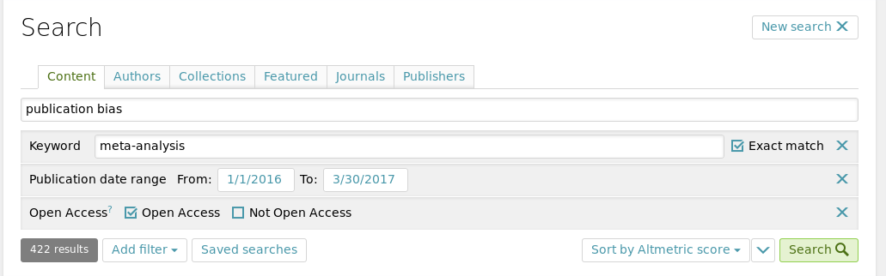

# Corpus

Searching for the Open Access corpus is done with the ScienceOpen search. [This](https://www.scienceopen.com/search#%7B%22id%22%3A%22%22%2C%22context%22%3Anull%2C%22kind%22%3A77%2C%22order%22%3A0%2C%22orderLowestFirst%22%3Afalse%2C%22query%22%3A%22publication%20bias%22%2C%22filters%22%3A%5B%7B%22kind%22%3A43%2C%22query%22%3A%22meta-analysis%22%2C%22exactMatch%22%3Atrue%7D%2C%7B%22kind%22%3A37%2C%22dateFrom%22%3A1451602800000%2C%22dateTo%22%3A1490911199999%7D%2C%7B%22kind%22%3A84%2C%22openAccess%22%3Atrue%2C%22notOpenAccess%22%3Afalse%7D%5D%7D) is the URL used on March 30, 2017 to search for meta-analyses that mention something about publication bias.

It says 422 results, but when browsing through it on the page gives only 370 results (at least that's what ScienceOpen shows...). One [article](http://www.ncbi.nlm.nih.gov/pmc/articles/5054138) was left out, resulting in 369 articles (this article didn't have a DOI).

# Ideas

1. Extend this to flowcharts to analyze CONSORT or PRISMA flows
