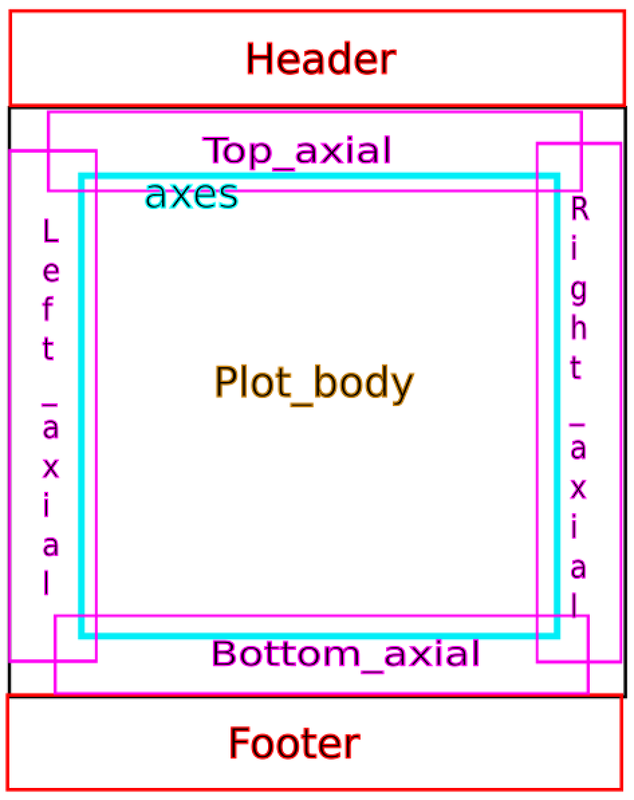
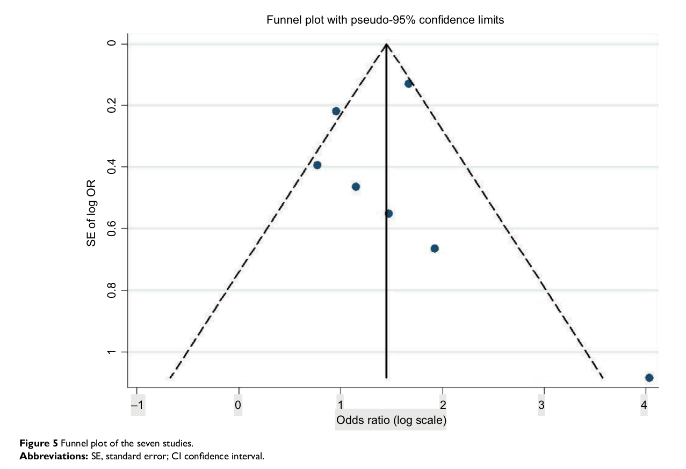

```{r, echo=FALSE}
fignr <- 1

dat <- read.csv('../data/corpus.csv', as.is = TRUE)
dois <- dat$doi[dat$true_vector == 'yes' & !is.na(dat$doi)]
dois <- dois[!is.na(dois)]
vec_dat <- read.csv('../data/funnels.csv')
```

# Introduction

Information from figures in scholarly articles can be harvested for the underlying data [see also the "In Brief" report; @Hartgerink-dlib2017]. Figures are typically presented in order to communicate something about the underlying data, but in a static way. As such, reshaping this communication is not readily possible, because the data are not available. Examples of reuse if the data are available could be as simple as joining data across figures, standardizing axes across figures for easy comparison, or using the data to compute relative numbers instead of absolute numbers. Moreover, considering the current low rates of data sharing [@10.1037/0003-066x.61.7.726;@10.1525/collabra.13;@10.1080/08989621.2012.678688] and rapid decrease of the odds of successfully requesting those data [@10.1016/j.cub.2013.11.014], reusing those data in the long run becomes effectively impossible. Hence, we find it important to be able to have alternative ways of collecting data from results presented in a scholarly report.

Some figures are stored in bitmap format whereas others are stored in vector format. In a bitmap format the image is stored by saving the color code for each pixel. This means that information about overlapping datapoints is lost, because a pixel in a bitmap does not differentiate between different layers. However, in a vector format, information is stored on the shape and its position on the canvas, which is unrestricted to a specific pixel size. As such, these images can be enlarged without loss of image quality. Moreover, the position of those shapes can be retraced in order to reconstruct data points in a figure. This can even be done when data points overlap, because unlike in the pixel format, overlapping shapes are stored separately in a vector image.

In the current report, we share the results of software (alpha stage) to extract raw data from vector based figures. More specifically, we report the method of data extraction and the effectiveness and provide documentation for increasing ease-of-use for the software. Finally, we review the potential of using vector based images to extract data from scholarly reports. 

# Method

## Extraction procedure

At the highest level, typical figure components are the body, header, footer, and axes. Figure `r fignr` provides a conceptual depiction of the figure components. In order to extract data, recognition of some these components is mandatory, whereas recognition of others is optional. For example, the header and footer are irrelevant to data extraction, but are relevant to data comprehension; hence these are optional. Left- and bottom axes are mandatory, because these typically depict the scale of the presented plots. Right- and top axes are optional because they, as far as we know, rarely are used as the main axes and mostly are just to delimit the plotbox. Logically, the body of the plot, containing the depicted data, is mandatory for extraction. 

```{r, echo = FALSE, out.width="40%", fig.align="center",  fig.cap="Conceptual representation of the typical components to a data based plot. This serves as the basis of the software to extract data from the plot body."}

```

Based on the plot body, absolute locations of the individual data points are extracted. Not all vector images are created in a similar way, but in the simplest scenario with circles, the vector gives three parameters: the $x$ coordinate of the centre, the $y$ coordinate of the centre, and the radius $r$. As such, for a simple circle the underlying vector code might look as follows:
```html
<circle cx="103.71" cy="121.22" r="25.234" fill-opacity="0" stroke="#cf1d35" stroke-width=".26458"/>
```
This information can be readily extracted after isolating the vector figure from a PDF file. The current alpha software is primarily developed to operate on circles of similar size within one plot.

In order to make the absolute locations of the shapes represent the original data points as accurately as possible, they need to be mapped onto the x-axis and y-axis. Although absolute locations retain the relative relations between the individual data points, they are not representative of the original data. As such, the software extracts the location of the axes and their respective scales. Subsequently, the location of the x-axis and y-axis, combined with the information about the scale, are combined to remap the absolute locations on the canvas into the original data points.
<!-- verify with PMR -->

## Corpus

Using ScienceOpen, we searched for meta-analytic reports that mention "publication bias". For this project, we focused on funnel plot figures from meta-analyses, hence this search approach. We restricted our search on ScienceOpen to Open Access reports, in order to freely redistribute those reports in our [Github repository](https://github.com/chartgerink/2015ori-3) for this project. This facilitates reproducibility of the data based on the newly developed software. We searched the ScienceOpen database on March 30 2017, resulting 422 reports based on the search criteria (Figure `r fignr`), but the webpage presented only `r dim(dat)[1]` reports. 

```{r, echo=FALSE, out.width='100%', fig.cap="Screenshot of the search criteria used to search ScienceOpen."}
knitr::include_graphics('../figures/search-results.png')

fignr <- fignr + 1
```

We manually searched through these `r dim(dat)[1]` reports for vector based images. The first author (CHJH) opened each article and checked for various aspects: (1) whether a funnel plot was present; (2)if so, how many funnels were present, and (3) whether the funnel plots were vector based. In order to determine whether a funnel plot was vector based, a heuristic was used. This heuristic was to try and select the axes (either x-axis or y-axis) from the plot. If the labels from the tickmark were selectable, the plot was deemed to be vector based, otherwise it was eliminated. This is a liberal heuristic we found out, considering some publishers present vector axes but incorporate a bitmap plot body (see Figure `r fignr`). This approach allowed us to subsequently prune the plots further and retain only the plots with vector bodies.

```{r, echo = FALSE, out.width='100%', fig.cap="Example of a funnel plot with selectable axes [@10.2147/amep.s116699], but including a bitmap body. This can be seen by the large difference in quality between the body and the axes, where the axes are crisp and the body is pixelated. The x-axis is selected."}

```

## Documentation

```{r, echo = FALSE}
stepsnr <- 5
```

In order to extract data from figures with the software `norma`, `r stepsnr` steps need to be taken. First, the user needs to organize all PDFs into one folder. Second, this folder needs to be converted to a `cproject` structure. The `cproject` structure normalizes the contents for each paper into a `ctree`, such that subsequent operations can be standardized trivially (and extensions can be applied relatively easily). For example, the root folder might contain `ctree1.pdf`, but after transforming the root folder into a `cproject` it contains a folder `ctree1/` with `fulltext.pdf`. By running the command 
```bash
java -jar bin/norma-0.5.0-SNAPSHOT-jar-with-dependencies.jar --project corpus-test2  --fileFilter '.*/(.*).pdf' --makeProject '(\1)/fulltext.pdf'
```
the folder is restructured into a `cproject` structure similar to this:
```bash
cproject/
├── ctree1
│   └── fulltext.pdf
├── ctree2
│   └── fulltext.pdf
...
└─── ctreeN
    └── fulltext.pdf
```

After converting the folder into a `cproject`, the `norma` software is applied to convert the PDF files into SVGs and extract the individual figures. In order to convert each page of the PDF into a separate SVG file, we used the following command
```bash
java -jar bin/norma-0.5.0-SNAPSHOT-jar-with-dependencies.jar --project corpus-test2 -i fulltext.pdf --outputDir figures --transform pdf2svg
```
resulting in a `svg/` folder for each `ctree`. That is,

Dependencies for the software are included in the packaged command line tool for `norma` and the user is only required to have Java installed. 

1. Have pdfs
2. Make cproject
3. Convert pdfs to svg
4. Manually clip pages with plots of interest to only retain plot of interest
5. Convert figures to data

# Results

Through searching on ScienceOpen, we identified `r sum(dat$vector == 'yes', na.rm = TRUE)` meta-analytic reports containing vector based funnel plots. Upon manual inspection of those `r dim(dat)[1]` meta-analytic reports, only `r sum(dat$funnel == 'yes', na.rm = TRUE)` contained funnel plots. Of those `r sum(dat$funnel == 'yes', na.rm = TRUE)`, we identified `r sum(dat$vector == 'yes', na.rm = TRUE)` reports with vector based images. As mentioned in the methods section, we determined whether a funnel plot was vector based by trying to select the ticks on the axes; if these were selectable, we deemed the funnel plot a vector.

2. Extracting data
  * Identified vectors == vector: `r sum(dat$true_vector[dat$vector == 'yes'] == 'yes', na.rm = TRUE)`
  * Number of vectors in those papers: `r sum(dat$nr_funnel[dat$true_vector == 'yes'], na.rm = TRUE)`
  * DOIs of papers that were extracted: `r dois`
  * Number of vectors with data extracted: `r sum(vec_dat$data_extracted)`
  * data mapped correctly: `r sum(vec_dat$x_ax_mapped == 'yes' & vec_dat$y_ax_mapped == 'yes', na.rm = TRUE)`

```{r, echo = FALSE}
df <- data.frame(doi = dois)
knitr::kable(df, caption = "Papers")
```

# Discussion

As the results indicate, vector based images are a .

However, the usage of vec

# Author notes

All presented materials in this report are version-controlled and freely available on Github (https://github.com/chartgerink/2015ori-3), and were preserved upon submission at Zenodo [@]. This research was funded by the Office of Research Integrity under grant NUMBER_INSERT.

# References
