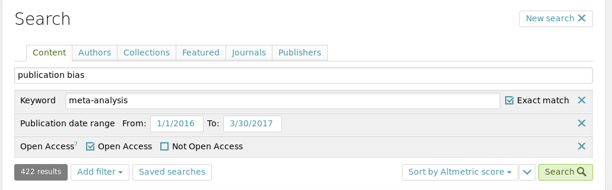

```{r, echo=FALSE}
fignr <- 1

dat <- read.csv('../data/corpus.csv', as.is = TRUE)
dois <- dat$doi[dat$true_vector == 'yes' & !is.na(dat$doi)]
dois <- dois[!is.na(dois)]
vec_dat <- read.csv('../data/funnels.csv')
```

# Introduction

Information from figures in scholarly articles can be harvested for the underlying data [see also the "In Brief" report; @Hartgerink-dlib2017]. Figures are typically presented in order to communicate something about the underlying data, but in a static way. As such, reshaping this communication is not readily possible, because the data are not available. Moreover, considering the current low rates of data sharing [] and rapid decrease of the odds of successfully requesting those data [], reusing those data, in the long run, becomes effectively impossible. Hence, it is increasingly important to be able to have alternative ways of collecting data from results presented in a scholarly report.

However, some figures are stored in bitmap format whereas others are stored in vector format. In a bitmap format the image is stored by saving the color code for each pixel. However, in a vector format, information is stored on the shape and its position on the canvas, which is unrestricted to a specific pixel size. As such, these images can be enlarged without loss of image quality. Moreover, the position of those shapes can be retraced in order to reconstruct data points in a figure. This can even be done when data points overlap, because unlike in the pixel format, overlapping shapes are stored separately in a vector image.

In the current report, we share the results of software (alpha stage) to extract raw data from vector based images. More specifically, we report the method of data extraction and the effectiveness of this. Finally, we review the potential of using vector based images to extract data from scholarly reports.

# Method

## Corpus

Using ScienceOpen, we searched for meta-analytic reports that mention "publication bias". ScienceOpen aggregates several databases and preprint services, resulting in over 30 million records. Moreover, the ScienceOpen database allowed us to restrict search results to Open Access publications, in order to be able to freely redistribute those publications in our [Github repository](https://github.com/chartgerink/2015ori-3) for this project. This facilitates reproducibility of the data based on the newly developed software. We searched the ScienceOpen database on March 30 2017, resulting 422 reports based on the search criteria (Figure `r fignr`), but the webpage presented only `r dim(dat)` reports. 

```{r, echo=FALSE, out.width='100%', fig.cap="Screenshot of the search criteria used to search ScienceOpen."}


fignr <- fignr + 1
```

2. Collect corpus and data on vector images
  * Determine vector figure based on selectable axes
  * 

## Extraction procedure


# Results

Through searching on ScienceOpen, we identified `r sum(dat$vector == 'yes', na.rm = TRUE)` meta-analytic reports containing vector based funnel plots. Upon manual inspection of those `r dim(dat)` meta-analytic reports, only `r sum(dat$funnel == 'yes', na.rm = TRUE)` contained funnel plots. Of those `r sum(dat$funnel == 'yes', na.rm = TRUE)`, we identified `r sum(dat$vector == 'yes', na.rm = TRUE)` reports with vector based images. As mentioned in the methods section, we determined whether a funnel plot was vector based by trying to select the ticks on the axes; if these were selectable, we deemed the funnel plot a vector.

2. Extracting data
  * Identified vectors == vector: `r sum(dat$true_vector[dat$vector == 'yes'] == 'yes', na.rm = TRUE)`
  * Number of vectors in those papers: `r sum(dat$nr_funnel[dat$true_vector == 'yes'], na.rm = TRUE)`
  * DOIs of papers that were extracted: `r dois`
  * Number of vectors with data extracted: `r sum(vec_dat$data_extracted)`
  * data mapped correctly: `r sum(vec_dat$x_ax_mapped == 'yes' & vec_dat$y_ax_mapped == 'yes', na.rm = TRUE)`

```{r, echo = FALSE}
df <- data.frame(doi = dois)
knitr::kable(df, caption = "Papers")
```

# Discussion

As the results indicate, vector based images are a .

However, the usage of vec

# References
