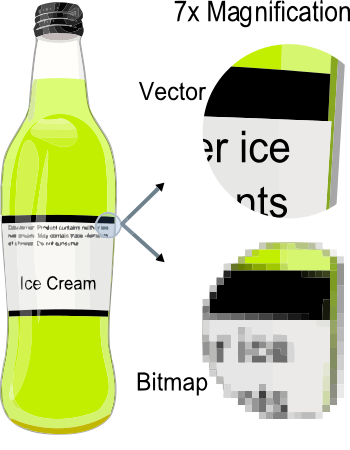
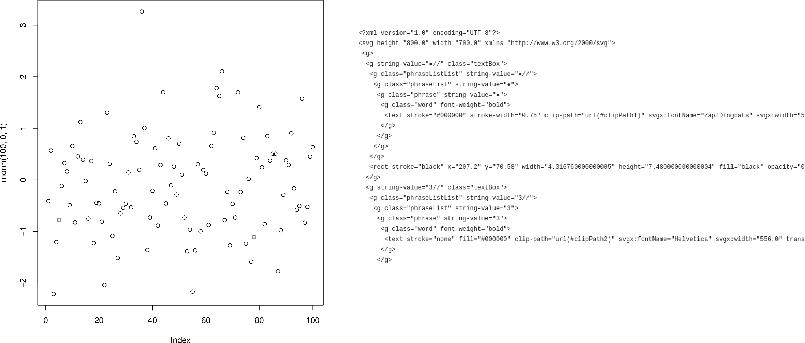

Scholarly articles contain much information. Scholarly data, however, are more often unavailable than available [@10.1037/0003-066x.61.7.726;@10.1525/collabra.13], even upon request [@10.1080/08989621.2012.678688], and increasingly unavailable over time [@10.1016/j.cub.2013.11.014]. Data on which scholarly articles are based are valuable for various reasons (e.g., for reanalyses to verify or to nuance claims made in the original article). 

While the value of data sharing is often recognized [e.g., @10.1177/0956797617704015;@10.1056/nejmp1607282, but see also @10.1056/nejme1516564], the practice of actually sharing data is limited [e.g., @10.1037/0003-066x.61.7.726;@10.1525/collabra.13;@10.1371/journal.pone.0007078], making alternatives valuable. Acquiring (parts of) the original data used to make certain claims is possible with data extraction instead of data sharing. Sharing is author-initiated by definition; data extraction on the other hand is user-initiated.

I see the potential for user-initiated data extraction from figures to improve data availability. Some figures contain raw data points (e.g., scatter plots, funnel plots in meta-analyses), which is information that can be extracted by machine but not by human-eye. Technically, mapping the points of data onto the x-y axes can be both difficult and easy at the same time, depending on the format the figure is presented in.

Figures can be presented in two formats: bitmap and vector images. Bitmap figures reduce the figure to specific bits of data, which indicate the coloring of each pixel in an image. As a result, enlarging the image reduces quality. Vectors on the other hand use (vectors of) coordinates on an x-y plane to depict shapes. As such, the shapes are mathematically determined and can be scaled to any size without the loss of quality. Figure 1 indicates an example of the quality when magnifying the resolution between bitmaps and vector images.

```{r fig:bitmapvector, fig.cap="_Figure 1._ Example showing the effect of vector graphics versus bitmap graphics. Original from [Wikimedia Commons](https://commons.wikimedia.org/wiki/File:VectorBitmapExample.svg), available under CC BY-SA 3.0", out.width="40%", fig.align="center", echo = FALSE}

```

Vector images therefore allow us to determine exactly the coordinates of (overlapping) data points in a figure, which allows us to extract the raw data presented in such figures. In order to do this, vector images need to be extracted from the article, converted to machine-readable code (e.g., `XML`), and subsequently the data point coordinates need to be mapped to the axes. Figure 2 shows an original scatter plot in vector format alongside the extracted `XML`, which can be directly used to extract the raw data.

```{r fig:raw, fig.cap="_Figure 2._ Example of a vector scatter plot (left) and resulting `XML` (right)", out.width="85%", fig.align="center", echo = FALSE}

```

In this project, I collaborate with [ContentMine](http://contentmine.org) to extract data from vector based funnel plots in meta-analyses. To this end, the software [`norma`](https://github.com/contentmine/norma) will be developed to automate data extraction from vector images. I will investigate performance of the software to extract raw data from vectors and report our findings in several months time. I will inspect performance by comparing the extracted values with eye-balled estimates from the figures to see whether they make sense on the scales. If possible, I will also compare these results with data presented in tabular format throughout the article. In the meantime, all steps in this research process are available on [GitHub](https://github.com/chartgerink/2015ori-3) and I welcome feedback, ideas (e.g., other types of vector based figures from which raw data might be extracted), or contributions (e.g., ethical discussions about extracting data that authors did not realize they shared) via the GitHub platform.

# References